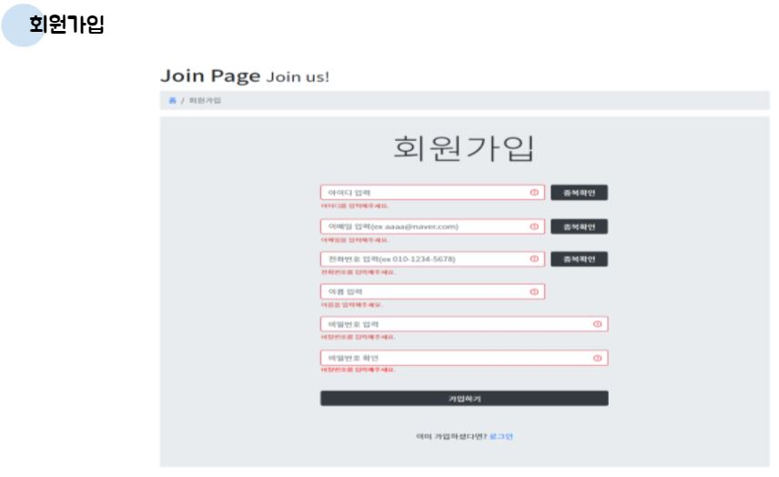
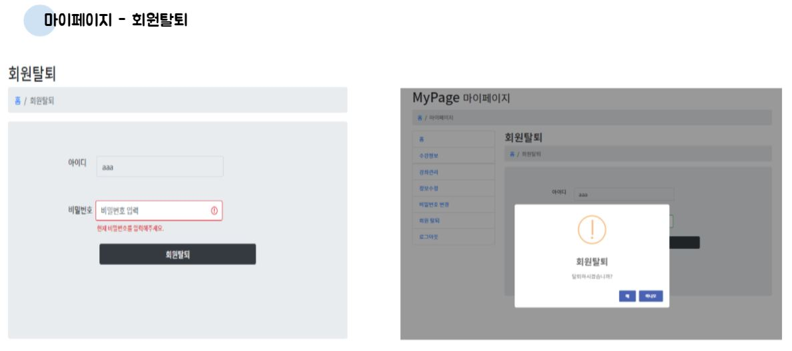

## 프로젝트

> 프로젝트 명 : 클래스팡
>
> 기간 : 2021.05.17 ~ 2021.06.13
>
> 팀원 : 김남수, 김동현, 안현진, 조민지

## 프로젝트 개요

> 프로젝트 배경
>
> - 코로나19로 인해 여행 등의 외부 취미 생활이 실내에서 즐길 수 있는 취미 생활로 트랜드 변화
> - \#다꾸 #홈트 #방꾸 #폰꾸 등 나만의 취향을 중시하는 MZ세대의 취향반영
> - 시간 제한이 없으며, 언제 어디서든 인터넷이나 모바일 기기만 있으면 이용할 수 있는 온라인 시스템 선호

> 프로젝트 목적 및 주제
>
> - 누구나 온라인으로 취미 클래스를 개설하고, 원하는 강의를 수강할 수 있는 온라인 클래스 시스템

> 프로젝트 상세
>
> - 내가 자신있는 분야를 가르칠 수도 있고 부족한 분야는 배울 수 있는 웹 어플리케이션 
> - 코치로 등록하여 수업자료를 배포하고 동영상을 업로드
> - 동영상  강의를  등록하고  수강할  수  있는  서비스  개발
> - Spring REST API 백엔드  구성
> - 스프링 웹 MVC, Mybatis, Ajax, JQuery, PL/SQL 기술  적용
> - Spring / Oracle / jsp 기반  웹 서비스

#### ERD

## 핵심기능 및 기대효과

> 핵심기능
>
> - 강의 및 강사 검색, 강의 개설, 강좌(동영상) 업로드, 강좌 보기  
> - 수강 신청, 나의 수강중인 강좌 일정, 수강평 작성

> 기대효과
>
> - 누구나 강좌를 개설할 수 있어 다양한 주제의 강좌를 운영할 수 있음
> - 강의 평점 시스템, 온라인 출결 시스템 등 기능 확장 가능
> - 결제 시스템, 유료화 시스템을 도입하여 사업화 가능

## 시연영상

https://www.youtube.com/watch?v=KsbCND2-Wvw

## 페이지 소개

#### 

